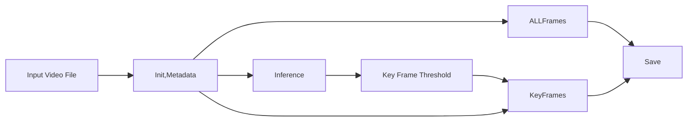
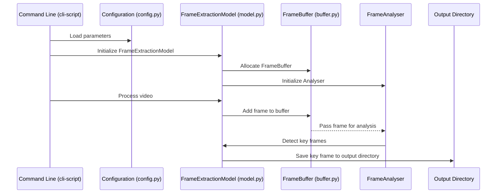

# Video Frame Extractor

Performant and advanced Python library + CLI for video frame extraction and analysis. Provides adaptive key-frame analysis based on motion detection and multi-frame image differentials. 
Supports multiple Video input and Image output formats, and implements multi-threading and memory management to optimise resource utilisation. 
Designed to be particularly well suited to medical imagery or generic videos with incremental (but not necessarily smooth or consistent) movement - be they screen captures, panorama shots, presentations or any multitude of other things.

## Features

### Core Capabilities
- Highly configurable CLI tool ready to interact with the library
- "Key-frame" detection (to identify the most significant _high quality_ frames).
  - Motion and content analysis (from opencv library) over multiple previous frames compared to existing key-frame set.
  - Frame quality detection via contrast and sharpness detection, and additionally including Structural SIMilarity (SSIM) library from scikit-learn (sklearn) for scoring for comparing subsequent candidate frames with existing (sub)set of identified key-frames as needed. 
- Inference pre-computation mode to estimate the library parameters needed to generate a set of _N_ key frames from the video
- Concurrent frame processing with configurable thread pools, and a shared thread-safe frame cache and memory-efficient video frame buffering

### Analysis Features
- Motion detection using optical flow analysis
- Frame Quality measurement signals:
  - Sharpness using Laplacian variance, really means looking for blurry low quality frame
  - Noise using denoising difference
  - Contrast using simple intensity distribution
  - Exposure using histogram analysis
- Scene change detection
- Temporal pattern recognition
Almost all one of these are overkill in most scenarios; but they're fun.

### Performance Features
- Configurable thread pool for parallel processing of frames
- Memory-optimized thread-safe frame buffer and recent frame cache
- Minimal frame copying via efficient np view operations
- Retry mechanims for failed frame extraction via exponential backoff with jitter (just because ;))

## System Requirements

### Software Requirements
- Python 3.12+
- OpenCV Python (opencv-python)
- NumPy
- scikit-learn (for SSIM)

## Usage

### Basic Usage
The video processor can be run from the command line with minimal configuration:

```bash
python cli-script.py input.mp4 output_dir/
```

### Required Arguments
- `input_video`: Path to input video file
- `output_dir`: Directory for output frames

### Advanced Usage Options

<summary>Expand for more advanced configuration examples including controlling format and quality of output, configuring key-frame selection, optimising system resource utilisation and thread concurrency, logging parameters and failure/retry handling</summary>

<details>

  #### Output Format Configuration

  Control the format and quality of extracted frames:
    
  ```bash
  # Extract as JPEG with 85% quality
  python cli-script.py input.mp4 output_dir/ \
      --format jpeg \
      --quality 85
  
  # Extract as PNG with maximum compression
  python cli-script.py input.mp4 output_dir/ \
      --format png \
      --quality 9
  ```
  
  #### Frame Analysis Settings
  Configure key-frame selection:
  ```bash
  # Enable key frame detection with custom similarity threshold
  python cli-script.py input.mp4 output_dir/ \
      --enable-keyframes \
      --similarity 0.90
  ```
  
  #### Performance Tuning
  Optimize processing speed and resource usage:
  ```bash
  # Configure threading and memory usage
  python cli-script.py input.mp4 output_dir/ \
      --threads 4 \
      --buffer-size 60 \
      --max-memory 1024 \
      --disable-cache
  ```
  
  #### Error Handling Configuration
  Adjust retry behavior and timeouts:
  ```bash
  # Configure robust error handling
  python cli-script.py input.mp4 output_dir/ \
      --retries 5 \
      --retry-delay 1.0 \
      --frame-timeout 10.0 \
      --video-timeout 60.0
  ```
  
  #### Logging Configuration
  Control logging output and verbosity:
  ```bash
  # Enable detailed logging to file
  python cli-script.py input.mp4 output_dir/ \
      --log-level DEBUG \
      --log-file processing.log
  ```

</details>

### Complete Usage Example
```bash
python cli-script.py input.mp4 output_dir/ \
    --format jpeg \
    --quality 85 \
    --enable-keyframes \
    --similarity 0.95 \
    --threads 4 \
    --buffer-size 60 \
    --max-memory 1024 \
    --retries 3 \
    --log-level INFO
```

### Inference mode estimate threshold to generate specified number of key-frames
```bash
python ./cli-script.py 
    --format png 
    --inference-tolerance 0.00001 
    --target-frames 8  input.mp4 output/
```

<summary>Expand to see a visual representation and sample execution outputs of the processing flow
</summary>

<details>
This shows the processing flow, covering the three main scenarios and the flow through the cli tool to the library - 
- full-frame extraction
- extraction of key-frames based on a fixed similarity threshold you provide
- extraction of approximately _N_ key frames based on inferential estimation of the sensitivity threshold needed to produce the specific number of frames



### Sample output including inference mode

```bash
2024-10-27 13:44:13,490 - common - INFO - Logging configured at level 20
2024-10-27 13:44:13,490 - common - INFO - Video processing system initialized
2024-10-27 13:44:13,495 - __main__ - INFO - Created configuration: {'output_format': <OutputFormat.PNG: ('png', [16], False)>, 'compression_quality': 9, 'detect_key frames': True, 'similarity_threshold': 0.999620166015625, 'thread_count': 1, 'buffer_size': 60, 'cache_size': 60, 'enable_cache': True, 'max_memory_usage': None, 'retry_attempts': 3, 'retry_delay': 0.5, 'frame_timeout': 5.0, 'video_timeout': 30.0}
2024-10-27 13:44:13,495 - __main__ - INFO - Running inference mode to target 8 frames
Progress: 22%2024-10-27 13:44:15,657 - nframes - INFO - Found acceptable threshold 0.99829 producing 8 frames (target: 8)
2024-10-27 13:44:15,657 - __main__ - INFO - Inference complete: threshold=0.998, estimated frames=8

Inference Results:
Optimal similarity threshold: 0.998
Estimated frame count: 8
Search iterations: 12

Processing video with inferred threshold...
Progress: 100%
2024-10-27 13:44:15,973 - processor - INFO - Processed 180 frames, kept 35 key frames
2024-10-27 13:44:15,973 - __main__ - INFO - Processing complete. Extracted 35 frames.
Successfully extracted 35 frames to output
2024-10-27 13:44:15,974 - common - INFO - System cleanup completed
```
Note there is a discrepency between estimated and actual frames generated because the estimator uses a simplified method to estimate key frame thresholds, whilst the full extraction compares not just a frame with its preceding 2 frames but a configurable number typically much higher. If this is problematic you can adjust the target frames accordingly.

</details>

<summary>Expand to see a visual representations of the library and CLI tool's processing of a video file
</summary>
<details>
The module interaction diagram shows how the main components communicate during the processing of a video file.


</details>

### Parameters Reference

#### Output Format Options
- `--format`: Output format for frames
  - `png`: Lossless compression (default)
  - `jpeg`: Lossy compression, smaller files
  - `webp`: Modern format with good compression
- `--quality`: Quality/compression level
  - PNG: 0-9 (9 = max compression)
  - JPEG/WebP: 0-100 (100 = best quality)

#### Processing Options
- `--enable-keyframes`: Enable key frame detection
- `--similarity`: Similarity threshold (0.0-1.0, default: 0.95)
- `--target-frames`: When specified enables automatic estimation of `--similarity` value so _n_ frames are produced
- `--threads`: Number of processing threads (default: CPU cores - 1)

#### Resource Management
- `--buffer-size`: Frame buffer size (default: 30)
- `--cache-size`: Frame cache size (default: 30)
- `--max-memory`: Maximum memory usage in MB (unbound if not speciifed)
- `--disable-cache`: Disable frame caching

#### Error Handling
- `--retries`: Number of retry attempts (default: 3)
- `--retry-delay`: Initial delay between retries in seconds (default: 0.5)
- `--frame-timeout`: Frame operation timeout in seconds (default: 5.0)
- `--video-timeout`: Video operation timeout in seconds (default: 30.0)

#### Logging Options
- `--log-level`: Logging verbosity
  - `DEBUG`: Detailed debugging information
  - `INFO`: General operation information
  - `WARNING`: Warning messages
  - `ERROR`: Error messages
  - `CRITICAL`: Critical issues
- `--log-file`: Path to log file (default: console output)

## Performance Considerations

### Memory Usage
- Frame buffer size directly impacts memory usage
- Monitor memory usage through built-in tracking

### CPU Utilization
- Thread count affects CPU usage and processing speed
- Default thread count is (CPU cores - 1)

### Storage I/O
- Buffer size affects disk I/O patterns
- Larger buffers reduce I/O frequency but increase memory usage
- Output format affects storage requirements:
  - PNG: Lossless, larger files (but supports compression)
  - JPEG: Lossy, smaller files (depending on quality setting)
  - WebP: Modern format, good mix between compression and quality

### Error Handling and Recovery
- Configurable automatic retry of frame extraction operations with exponential-backoff
- Comprehensive error logging
- Transaction-like operations with cleanup handlers
- As in any complex system of this nature, multi-thread concurrency, caching and frame buffering are likely to be the first thing you should try disabling if you do see errors.

## Monitoring and Debugging

### Logging
- Available log levels: DEBUG, INFO, WARNING, ERROR, CRITICAL
- Performance metrics tracked via logs including:
  - Frame processing times
  - Memory usage statistics
  - Thread pool utilization
  - I/O operations monitoring
- Error tracking includes:
  - Detailed error messages and stack traces
  - Operation context
  - Cleanup operation status
  - Resource management events

### Todo / improvements

##### Build and integrate Unit tests
##### Have an option to resize the video before or after processing
##### Integrate it with my image-gridder so that the resulting images are auto-cropped and put against the backdrop of a semi-transparent grid, also compressed heavily for network transit.
##### Increase pylint score (around 0.9 at time of writing)
##### Properly package dependencies, including versions, and creaate package.toml. setup.py and other components,  move source to `src` folder structure
##### SSIM should be optional :) It's expensive, might not even be that great.
##### Consolidate logging and code comments in some of the scripts
##### It would be nice to have a debug mode where e.g., particuar factors like weight of SSIM vs Frame histograms, parameters for quality detection such as blurring via method
##### Integrate the FrameData structure into classes like processor and nframes (nframes.py is the inference to solve for sensitivity parameter)
##### Dockerised deployment model and e.g., REST/HTTP API interface or expose the API via a container port/sshd to the container or such - this is not so relevant for my setup but I will do it because it enables some cloud deployments and fully controlling the runtime environment
##### Github Actions for running pylint, and running some end-to-end tests, potentially deploying to a cloud environment like GKE
##### I could see temporal.io being useful for orchestrating larger workflows that involve video manipulation and then subsequent processing downstream, might try to create a basic workflow/worker/activity set for this. 
